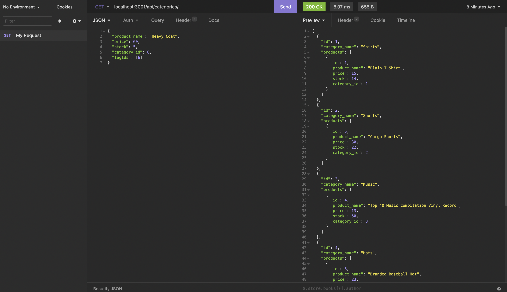

# E-Commerce-DB-Server-

# Description
Ecommerce DB provides all your back-end needs for your e-commerce business by utilizing express and mysql to provide a server and database to keep track of all your merchandise.

### Key Features
* Add new categories, products, and tags.
* Products have the ability to have many tags, and tags can be used on many products.
* Products, tags, and Categories can all be called by Id.
* All entries in the database can be easily updated or deleted.

# Technologies
* Node.js

### Npm packages used:
* dotenv
* express
* mysql2
* sequelize

# Installation and Use
* Download source code.
* Run "npm install" in the terminal.
* Login to mysql and run "source db/schema.sql". 
* Create a .env file and provide DB_USER and DB_PW keys (include DB_NAME='ecommerce_db').
* If you want to use the seeds I provided for testing purposes, run "npm run seed" in the terminal.
* Lastly, run "npm start" in your terminal to start the program.

If you'd like to see a walk-through video on how to use this program, click here: https://drive.google.com/file/d/1sOSt0uJNmTwmjq7a3XBSj-CFjyeOp08k/view?usp=sharing

Screenshot:  

